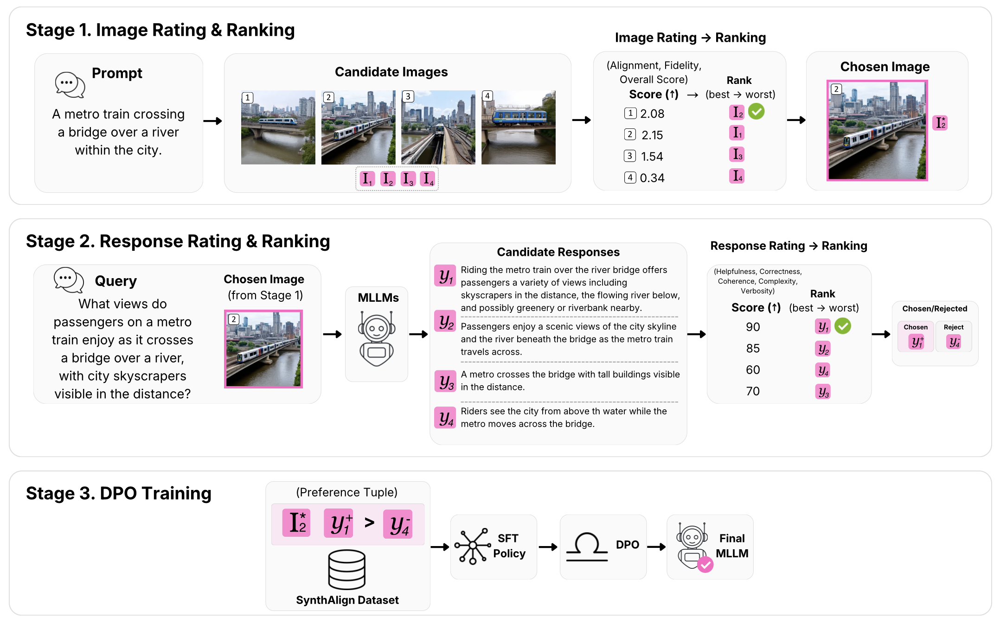

# SynthAlign: Improved Trustworthiness of Vision-Language Model via Synthetic Preference Data Alignment

<div align="center">

[](https://arxiv.org/abs/2412.17417)&nbsp;
[](https://huggingface.co/pdsdpo/PDS-DPO-7B)&nbsp;
[](https://huggingface.co/datasets/pdsdpo/pdsdpo-v1_0-data)&nbsp;

</div>

<p align="center" style="font-size: larger;">
  <a href="https://arxiv.org/abs/2412.17417">Multimodal Preference Data Synthetic Alignment with Reward Model</a>
</p>

### Introducing SynthAlign

SynthAlign builds synthetic multimodal preference data for DPO alignment. The pipeline starts from text-to-image prompts, generates multiple candidate images, ranks those images with an image reward model, asks open-source MLLMs to answer instructions about the selected images, ranks the candidate responses, and finally trains an MLLM with chosen/rejected preference pairs.

The dataset is designed for post-training: small amounts of high-quality preference data can steer safety, instruction-following, and response style, while larger curated sets can provide broader coverage.

<p align="center">
  
</p>

## News

* **2025-04:** We released an updated version of the [dataset](https://huggingface.co/datasets/pdsdpo/pdsdpo-v1_1-data), adding 3K new data with new categories and improved quality responses.
* **2024-12:** Our paper is available on [arXiv](https://arxiv.org/abs/2412.17417).
* **2024-12:** We open-sourced the code, weights ([7B](https://huggingface.co/pdsdpo/PDS-DPO-7B), [7B-LoRA](https://huggingface.co/pdsdpo/PDS-DPO-7B-LoRA)), and [dataset](https://huggingface.co/datasets/pdsdpo/pdsdpo-v1_0-data) for PDS-DPO.

## Installation

The pipeline has two tested dependency profiles:

| Profile | Use it for | Key versions |
| --- | --- | --- |
| `ranking` | Step 1 image generation/ranking and Step 2 response generation/ranking | `transformers==4.46.3`, `tokenizers==0.20.3`, `diffusers==0.31.0`, `image-reward==1.5` |
| `train` | Step 3 DPO training | `transformers==4.31.0`, `tokenizers==0.13.3`, `trl==0.7.7`, `deepspeed==0.14.4` |

Use Python 3.10. A Hugging Face token is required for gated assets such as Stable Diffusion 3 and for any private checkpoints or datasets you choose to use.

```bash
git clone https://github.com/pds-dpo/pds-dpo.git
cd pds-dpo
```

Recommended Step 1/2 environment:

```bash
conda create -n pdsdpo-ranking python=3.10 -y
conda activate pdsdpo-ranking
pip install --upgrade pip wheel "setuptools<81"
pip install -r requirements/step1_2.txt
huggingface-cli login
```

Recommended Step 3 environment:

```bash
conda create -n pdsdpo-train python=3.10 -y
conda activate pdsdpo-train
pip install --upgrade pip wheel "setuptools<81"
pip install -r requirements/step3.txt
huggingface-cli login
```

Patch TRL once in the Step 3 environment so DPO training can process image tokens:

```bash
TRL_DPO_TRAINER=$(python -c "import pathlib, trl; print(pathlib.Path(trl.__file__).parent / 'trainer' / 'dpo_trainer.py')")
cp tool/dpo_trainer.py "$TRL_DPO_TRAINER"
```

If you prefer a single conda environment, install `requirements/step1_2.txt` for Steps 1/2 and then install `requirements/step3.txt` before Step 3. This intentionally switches the `transformers`/`tokenizers` versions to the training-tested profile.

## Data Shortcut

You can skip Steps 1 and 2 and train directly from the released preference data:

* [pdsdpo/pdsdpo-v1_1-data](https://huggingface.co/datasets/pdsdpo/pdsdpo-v1_1-data), updated dataset release
* [pdsdpo/pdsdpo-v1_0-data](https://huggingface.co/datasets/pdsdpo/pdsdpo-v1_0-data), original release

Place the JSON preference file and corresponding images under `data/`. The default full training script expects:

```text
data/pds-dpo-9k-povid.json
data/<image files and folders referenced by the JSON>
```

## Step 1: Image Generation And Ranking

Sample text-to-image prompts are provided in `image_generation_ranking/prompts/sample.txt`. From the `ranking` environment:

```bash
cd image_generation_ranking
python run.py \
  --prompt-file prompts/sample.txt \
  --img-dir images/sample \
  --output-dir images/sample-ranked \
  --resume
```

The script writes all generated candidates to `images/sample/` and the top-ranked image for each prompt to `images/sample-ranked/`. Useful options:

* `--max-prompts N` runs a small smoke test.
* `--num-images N` changes the number of generated candidates per prompt.
* `--model-id MODEL_ID` changes the text-to-image model.
* `--resume` skips prompts whose ranked output already exists.

The same options can be set with `PDS_DPO_*` environment variables, for example `PDS_DPO_NUM_IMAGES=4`.

## Step 2: Response Generation And Ranking

Step 2 takes ranked images and instruction prompts, generates candidate MLLM responses, ranks the responses with a reward model, and writes DPO-ready chosen/rejected pairs.

To run against the images produced by Step 1:

```bash
cd response_generation_ranking
python run.py \
  --image-folder ../image_generation_ranking/images/sample-ranked \
  --prompt-file instruction-prompts/sample.txt \
  --output-json-file output_step1_images.json \
  --json-image-prefix images
```

By default, response generation uses:

* `llava-hf/llava-v1.6-mistral-7b-hf`
* `llava-hf/llava-v1.6-vicuna-13b-hf`
* `llava-hf/llava-v1.6-vicuna-7b-hf`

Response ranking uses `RLHFlow/ArmoRM-Llama3-8B-v0.1`. Useful options:

* `--max-items N` runs a small subset.
* `--reuse-responses` skips response generation and only reruns ranking from existing response files.
* `--model-ids id1,id2,...` changes the candidate MLLMs.
* `--response-files file1,file2,...` sets one response output file per model.
* `--ranker-device-map single` keeps the reward model on one GPU; this is the default tested setting.

The output JSON format is:

```json
[
  {
    "id": "transport-919",
    "image": "images/transport-919.jpg",
    "conversations": [
      {
        "from": "human",
        "value": "<image> What challenges does a ferryboat face as it crosses a turbulent sea, with passengers bracing against the spray and wind?"
      },
      {
        "from": "gpt",
        "value": "chosen response"
      }
    ],
    "rejected_conversations": [
      {
        "from": "human",
        "value": "<image> What challenges does a ferryboat face as it crosses a turbulent sea, with passengers bracing against the spray and wind?"
      },
      {
        "from": "gpt",
        "value": "rejected response"
      }
    ]
  }
]
```

To pass a Step 1/2 sample directly into Step 3:

```bash
cd ..
mkdir -p data/step3_sanity/images
cp response_generation_ranking/output_step1_images.json data/step3_sanity/step3_sanity.json
cp image_generation_ranking/images/sample-ranked/*.jpg data/step3_sanity/images/
```

## Step 3: MLLM Training With DPO

Activate the `train` environment and confirm the TRL trainer patch from the installation section has been applied.

Run a short sanity check first:

```bash
PDS_DPO_MAX_STEPS=20 ./scripts/run_dpo_sanity.sh
```

This assumes `data/step3_sanity/` was prepared from the Step 1/2 sample output. If you use a different sample, set `PDS_DPO_DATA_PATH` and `PDS_DPO_IMAGE_FOLDER`.

The sanity script defaults to a memory-reduced configuration that was verified on 2 x RTX 6000 Ada GPUs:

* `PDS_DPO_BITS=4`
* `PDS_DPO_LORA_R=8`
* `PDS_DPO_LORA_ALPHA=16`
* `PDS_DPO_MODEL_MAX_LENGTH=1024`
* `PDS_DPO_GRADIENT_CHECKPOINTING=False`
* `WANDB_MODE=offline`

For full training on the released dataset:

```bash
./scripts/run_dpo.sh
```

The full script defaults to the paper-style LoRA configuration and expects 2 x 80GB A100 GPUs. On smaller GPUs, start from the memory-reduced settings:

```bash
PDS_DPO_BITS=4 \
PDS_DPO_LORA_R=8 \
PDS_DPO_LORA_ALPHA=16 \
PDS_DPO_MODEL_MAX_LENGTH=1024 \
PDS_DPO_GRADIENT_CHECKPOINTING=False \
./scripts/run_dpo.sh
```

Common overrides:

* `PDS_DPO_DATA_PATH=./data/your_data.json`
* `PDS_DPO_IMAGE_FOLDER=./data`
* `PDS_DPO_OUTPUT_DIR=./checkpoints/your-run`
* `PDS_DPO_NUM_GPUS=2`
* `PDS_DPO_MAX_STEPS=100`
* `WANDB_MODE=online` and `WANDB_API_KEY=...` if you want W&B syncing

The tested workstation run confirmed that Step 3 enters DPO training and logs normal DPO metrics. The default full bf16 configuration can OOM on 48GB GPUs; use the memory-reduced settings above or larger GPUs for full-length training.

For comprehensive tutorials on evaluating other benchmarks, refer to the [LLaVA evaluation documentation](https://github.com/haotian-liu/LLaVA/blob/main/docs/Evaluation.md).

## License

This project incorporates specific datasets and checkpoints, each governed by their respective original licenses. Users are required to adhere to the terms and conditions outlined in those licenses. The project's content is independently licensed under the [Apache License 2.0](https://github.com/pds-dpo/pds-dpo/blob/main/LICENSE).

## Citation

```bibtex
@article{wijaya2024multimodal,
  title={Multimodal Preference Data Synthetic Alignment with Reward Model},
  author={Wijaya, Robert and Nguyen, Ngoc-Bao and Cheung, Ngai-Man},
  journal={arXiv preprint arXiv:2412.17417},
  year={2024}
}
```

## Acknowledgement

This research benefits from [LLaVA-1.5](https://github.com/haotian-liu/LLaVA), [ImageReward](https://github.com/THUDM/ImageReward), and [RLHF-Reward-Modeling](https://github.com/RLHFlow/RLHF-Reward-Modeling/). Thanks for their great work.
